# Creating and publishing Web Stories

## Introduction

Web Stories are short, full-screen videos(similar to those found on various social media platforms) built on Google's open Web Stories standard. They are designed for quick, mobile-first storytelling using images, videos and short texts that readers tap through one at a time.

For National Meteorological and Hydrological Service(NMHS), Web Stories are a good fit for content that benefits from a quick visual format rather than a a long article. For example, a seasonal outlook explainer or public awareness campaign.

In ClimWeb, Web Stories are managed from the **Web Stories** section. Published stories are automatically included in the site's sitemap, hence making them easier to search for.

This guide walks through the full workflow: Creating a story, adding and ordering slides, adding media and text overlays, previewing, publishing and managing stories after they are published.

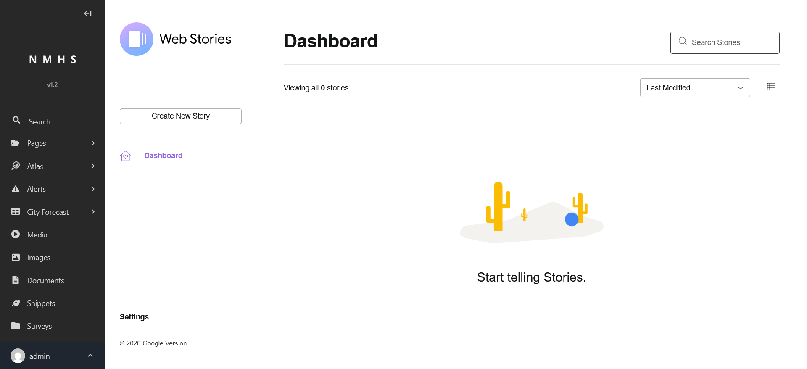

## Prerequisites

Before creating your first Web Story, verify the following, especially on a freshly installed instance:

1. **A Home Page must exist and be published.** 
A fresh ClimWeb checkout has no pages beyond Wagtail's generic "Welcome to your new Wagtail site" placeholder. Create and publish a real Home Page first (select *Pages*, select *Add child page*, fill in required fields, Publish), and confirm it is set as the site's root page under *Settings*, *Sites*.

2. **A Web Stories listing page must exist and be published as a child of Home page.**
Without one, the Web Stories dashboard (`/cms-admin/web-stories-list/`) returns a server error, and the editor may not function correctly. To create it: select *Pages*, open *Home*, select *Add child page*, select *Web Story List Page*, give it a title (e.g. "Web Stories"), select *Publish*. Only one instance of this page is needed per site.

## Creating a story

1. Go to **Web Stories** in the using the Navigation menu on the left side of the screen.

> **Note 1 - Navigation menu toggle:** The navigation menu can be expanded or collapsed using the arrow button(|-> OR <-| respectively).

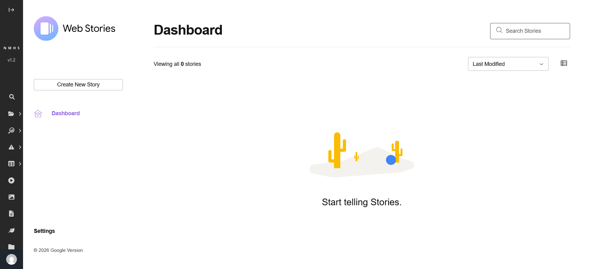

2. Click **Create New Story**.

> **Note 2 - Mobile navigation menu behavior:** On smaller screens, the navigation menu may shrink into a menu button (three horizontal lines inside a black square) located in the top-left corner of the screen. Tap or click this button to open the menu.

> **Note 3 - Dashboard menu collapsing:** Like **Note 2**, the **Create New Story** button may be shrunk into a menu button (three horizontal lines with a white background, next to the "Dashboard" title). Tap or click this button to open the menu.

  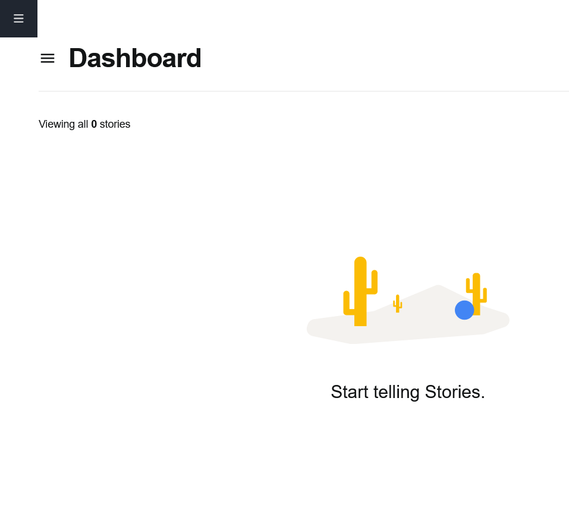
  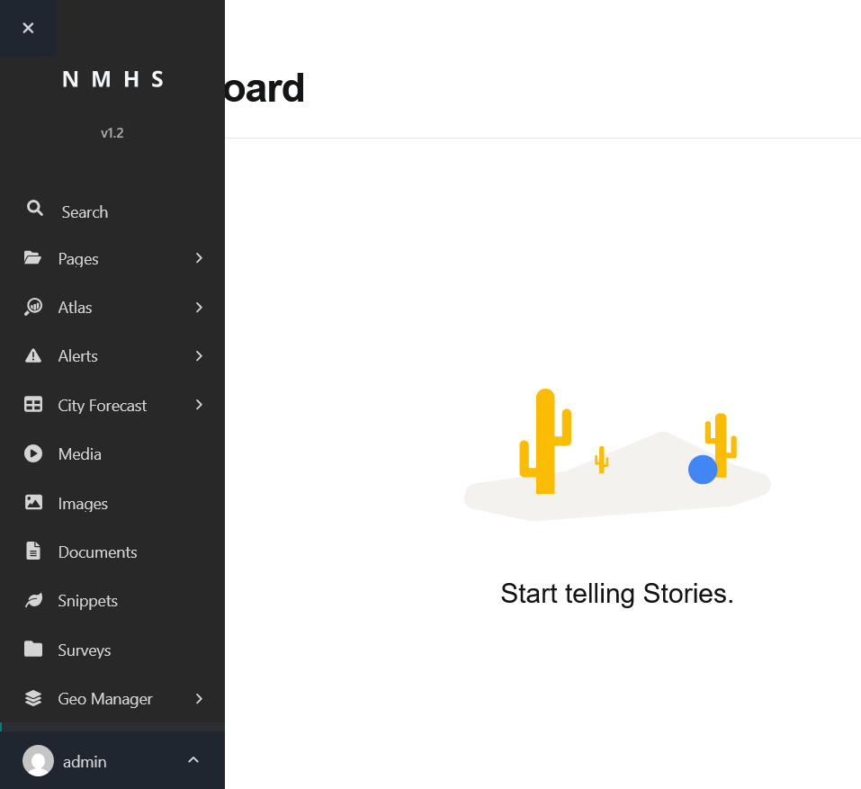
  

3. Fill in the story title, then save as a draft:
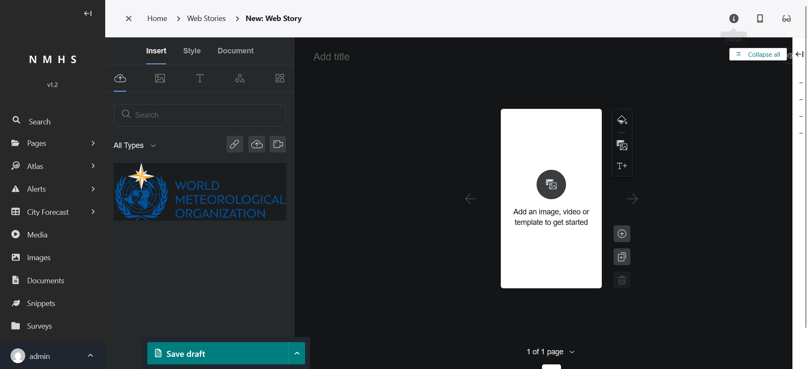

> **Note 4 - Missing title default** A story can be published with a blank title, ClimWeb will default the title to "Untitled." in this scenario.

4. Save the story by selecting *Save draft* in the bottom left of the screen. The other fields will be covered later in this guide (see Media and text overlays and Publishing).

> **Note 5 - Content drafting workflow:** You can create the story with just a title first, then build out content. You do not need to have every field filled in before adding content.

## Adding slides

Each story is made up of a sequence of slides. ClimWeb's slide editor supports a few different content types:

- **Image slide**: An image of PNG, JPG, AVIF, GIF, JPEG, or WEBP format, with a maximum filesize of 10.0 MB.

- **Video slide**: A video of AVI, H264, M4V, MKV, MOV, MP4, MPEG, MPG, OGV, or WEBM format. There is no video-specific filesize limit enforced by the editor. However the practical ceiling is the server's general upload limit of 25.0 MB by default. and may be lower if a reverse proxy in front of ClimWeb imposes its own limit.

- **Third-party media**: In addition to user uploaded images and video, the Insert panel includes a third-party stock media tab (photos, video, and GIFs from Unsplash, Cover, and Tenor) powered by Google's Media 3P proxy API. This works out of the box with no ClimWeb-side configuration required as the integration ships with the editor itself. Do note that all third-party assets are subject to the intellectual property and licensing policies of their respective platforms. Users are responsible for ensuring their use complies with these terms.

- **Shapes, stickers, and pre-built page templates**: These features are available from the Insert panel and when creating a new story. They are a fixed library built into the editor; they cannot be extended or supplemented with additional content. The search field matches only whole words within an item's name. For example, searching "fresh and bright" returns an item named "Fresh and Bright Cover", but searching "cover" alone does not. Category terms such as "Cover", "Section", or "Quote" are not matched by the search field; use the filter buttons below the search bar to filter by these instead.

To add a slide:

1. Open your story and click **+ New Page**.
3. Build out the slide's content (see [Media and text overlays](#media-and-text-overlays) below).
3. Repeat until you have all the slides you need.

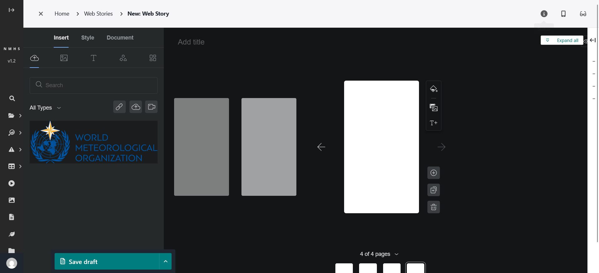

> **Note 6 - Google distribution guidelines:** Google’s Web Stories format recommends a minimum of 4 pages to be eligible for indexing, organic Search, and appearance on the Google Discover feed. Stories shorter than 4 pages are deemed incomplete by Google's guidelines and are typically suppressed from distribution ([Source: Google Search Central](https://developers.google.com/search/docs/appearance/web-stories-creation-best-practices)).

> **Note 7 - ClimWeb editor enforcement:**ClimWeb’s Web Story editor does not enforce this minimum page requirement at either the backend (Django) or frontend levels. While the underlying Web Stories editor contains a built-in pre-publish checklist helper, the editor does not block or pop up warnings during the publishing workflow if a story is under 4 pages or contains blank slides. Authors can successfully save and publish stories with only 2–3 slides, but should manually ensure they meet the 4-page minimum to guarantee search engine visibility.

## Media and text overlays

### Adding images

1. On a slide, open the **Insert** tab in the left panel.
2. Click the **upload icon** (cloud with an up arrow) in the row of small icons below the search bar, it sits between the **link** icon and the **video** icon.
3. In the dialog that opens, use the **Upload** tab to add a new file, or switch to the **Search** tab to choose an existing image from ClimWeb's media library.
4. Supported formats are PNG, JPG, AVIF, GIF, JPEG, and WEBP, with a maximum file size of 10.0 MB per image.
5. Adjust image on canvas as desired.

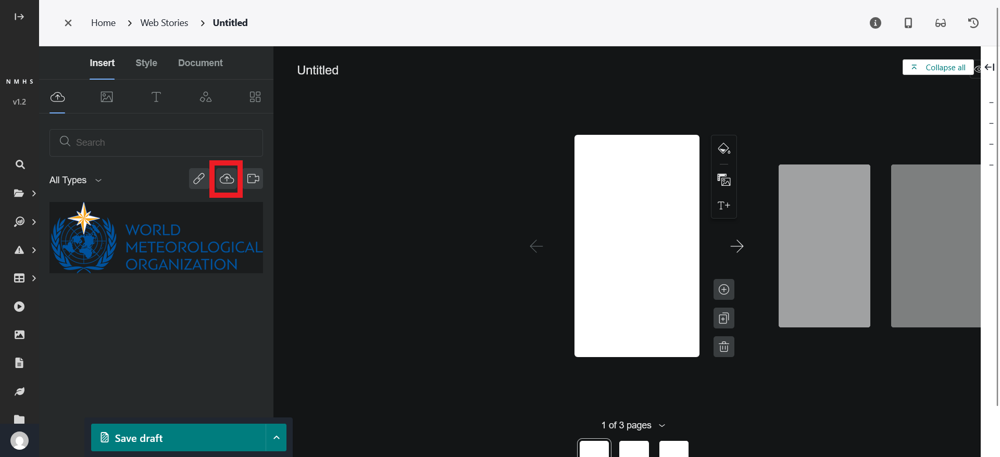

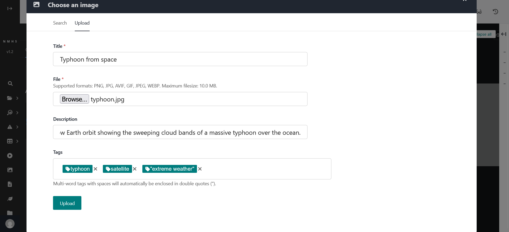

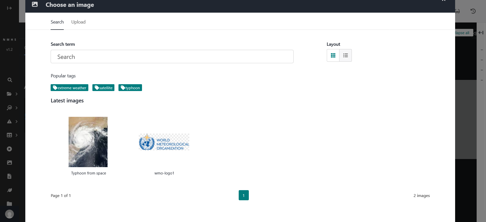

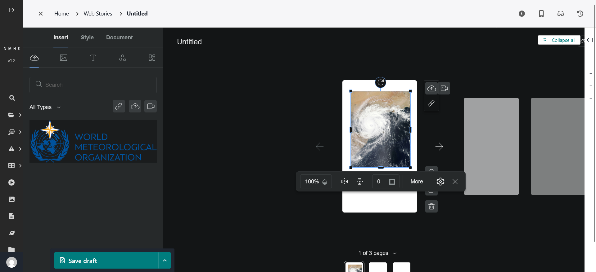

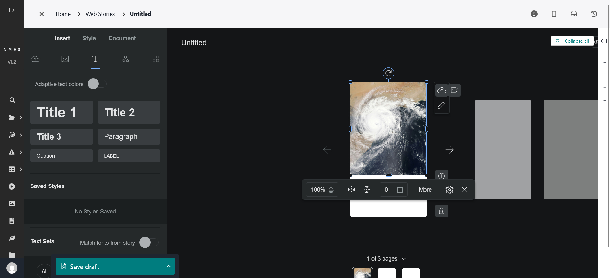

> **Note 8 - Entering tags when uploading images:** Press "Enter" after typing in individual tags to enter them. Multi-word tags with spaces will automatically be enclosed in double quotes(" ") by ClimWeb.

> **Important Note - Known Limitation:** The image selection list in the side panel can only show the first 20 images uploaded to the website. If the site has more than 20 images, any new images you upload will **not** appear in this browseable side list.
> **What this means for you:**
> * **New uploads still work:** You can safely click the upload button to add new images. Your files are saved properly, even if they disappear from the side list right after.
> * **Existing stories are safe:** Any images already placed inside your Web Story slides will display and publish perfectly.
> * **Where to find all images:** If you need to see, edit, or manage your full library of pictures, use the main website dashboard under the **Images** section instead of the Web Story editor's side panel.
> 
> This is a known display issue with the side list itself, not a sign that your upload failed. [Issue link: https://github.com/erick-otenyo/wagtail-webstories-editor/issues/2].

### Adding text overlay

1. With the slide open, click on the desired text types to add them to the canvas (or drag desired text types to add them to the canvas).
2. Use the text toolbar to adjust font, size, colour, alignment, and position on the slide.
3. Drag the text box to position it over the media so it stays readable (avoid busy parts of the image).

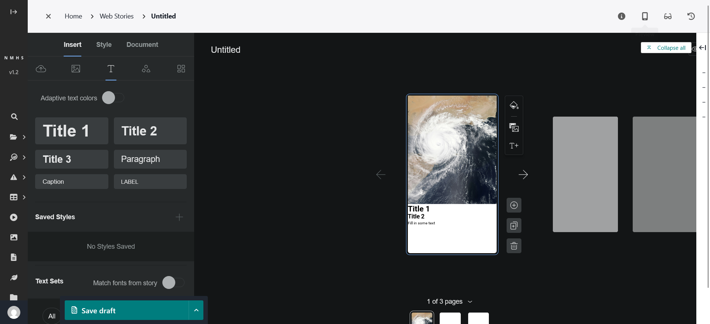

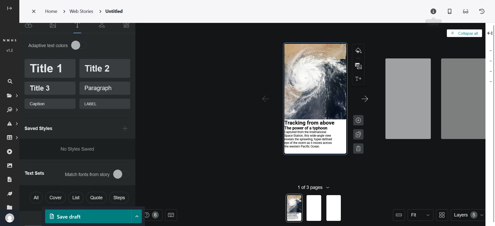

> **Note 9 – Text Manipulation and Scaling:** To reposition a text element on the canvas, click and drag within the text box boundaries. You must ensure the element is not in active text-editing (typing) mode. If the typing cursor is active, dragging will select text rather than move the container. To move the element, click outside the box to deselect it, then click once to select and drag it. Additionally, dragging the corner handles of the bounding box will dynamically scale the font size proportionally. To adjust the box width or wrap text without changing the font size, use the manual width and height inputs or the dedicated font size selector in the right-hand styling properties panel.

## Troubleshooting

| Problem | Likely cause | What to do |
|---|---|---|
| Images fail to load in the story editor, browser console shows a CORS error | `WAGTAILADMIN_BASE_URL` and/or the Wagtail Site record does not match the host/port actually being used | Align both to the same value (e.g. `http://localhost:8000`) and restart the server |